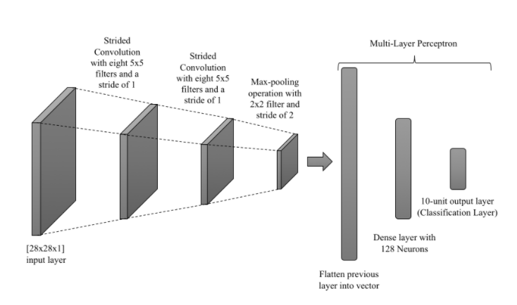
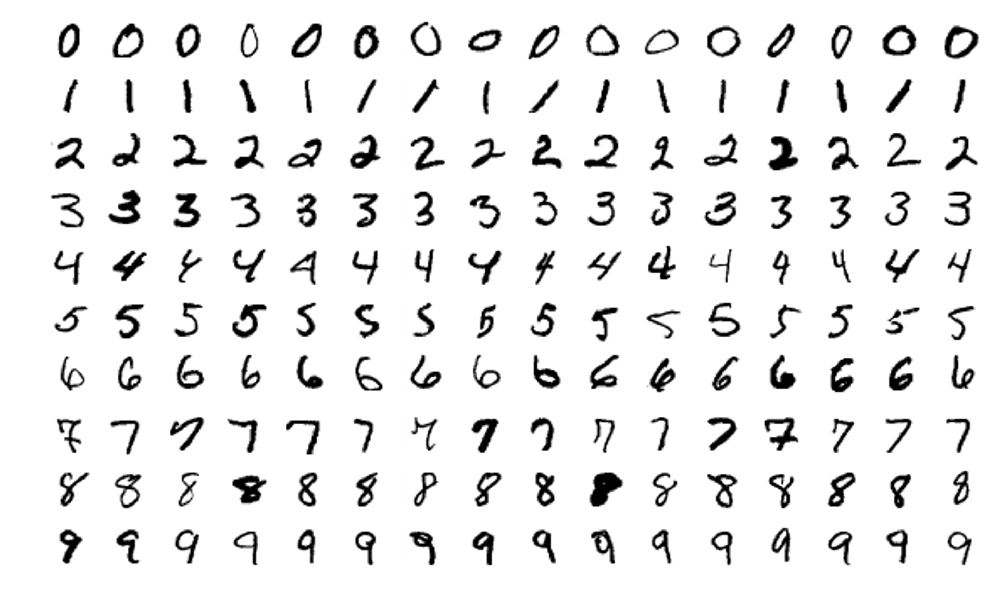
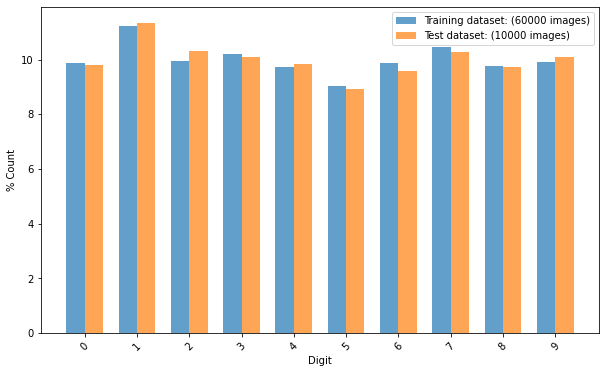
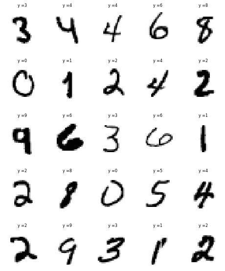
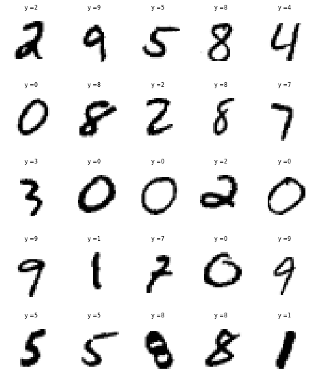
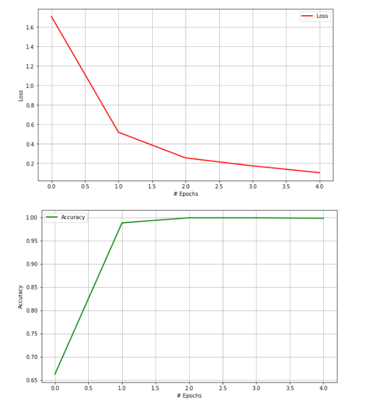

# Step-by-Step Implementation of Convolutional Neural Networks (CNN) from Scratch to Classify MINIST Dataset in Python

## 1. Objective

The objective of this project is to demonstrate the step-by-step implementation of a Convolutional Neural Network (CNN) from scratch to classify images of hand-written digits (0-9), using the MNIST data set.

## 2. Motivation

It is often said that “What I cannot build, I do not understand”. Thus, in order to gain a deeper understanding of Convolutional Neural Networks (CNN), I embarked on this project with the aim to built a CNN, step-by-step and from scratch in NumPy, without making use of any Deep Learning frameworks such as Tensorflow, Keras, etc. 

* Implementing a CNN from scratch is complex process, but it can be broken down to two phases

1. A forward phase, where the input is passed completely through the network:
  * During the forward phase, each layer will cache any data (like inputs, intermediate values, etc) it’ll need for the backward phase. This means that any backward phase must be preceded by a corresponding forward phase.

2. A backward phase, where gradients are backpropagated (backprop) and weights are updated:
  * During the backward phase, each layer will receive a gradient and also return a gradient. It will receive the gradient of loss with respect to its outputs and return the gradient of loss with respect to its inputs.

We shall illustrate the step-by-step implementation of these two main phases and break them down into several functionalities. We shall use the the MNIST handwritten standard dataset as the basis for learning and practicing how to develop, evaluate, and use convolutional neural networks for image classification from scratch. 

The structure of the implemented CNN is illustrated in the figure below. 

## 3. Data

* The MNIST database of handwritten digits, is widely used for training and evaluating various supervised machine and deep learning models [1]:

  * It has a training set of 60,000 examples
  * It has test set of 10,000 examples
  * It is a subset of a larger set available from NIST. 
  * The digits have been size-normalized and centered in a fixed-size image.
  * It is a good database for people who want to try learning techniques and pattern recognition methods on real-world data while spending minimal efforts on preprocessing and formatting.
  * The original black and white images from NIST were size normalized and resized to 28x28 binary images.
  * Sample images from the MNIST data set are illustrated next:
    * There are significant variations how digits are handwritten by different people
    * The same digit may be written quite differently by different people
    * More significantly, different handwritten digits may appear similar, such as the 0, 5 and 6 or the 7 and 9.

## 4. Development

In this section, we shall demonstrate how to develop a Convolutional Neural Network (CNN) for handwritten digit classification from scratch, without making use of any Deep Learning frameworks such as Tensorflow, Keras, etc. 

* The development process involves:

  * Reading and pre-processing the training and test data
  * Exploring and visualizing the training and test data:
    * Building the forward phase and backward phase of the CNN model
    * Training the built CNN model
    * Evaluating the performance of the trained CNN model.

* Author: Mohsen Ghazel (mghazel)
* Date: May 15th, 2021
* Project: Step-by-Step Implementation Convolutional Neural Networks (CNN) from Scratch using Numpy.

* Development Process:

1. Read and pre-process the training and test data:
  * We begin by reading the training and test MINIST datasets

2. Explore and visualize the training and test data:
  * We then inspect and visualize the training and test data sets

3. Build the CNN:
  * We then build the convolutional neural network, which consists of two phases:
  * A forward phase, where the input is passed completely through the network.
  * A backward phase, where gradients are backpropagated (backprop) and weights are updated.

4. Train the CNN:
  * We train the developed CNN on the training dataset.

5 Evaluate the performance of the trained CNN:
  * We shall evaluate the trained CNN based on the following performance evaluation metrics:
  * Training and validation loss as a function of the number of iterations
  * Training and validation accuracy as a function of the number of iterations
  * The confusion matrix
  * Examine sample mis-classified to get insights into their mis-classification.

### 4.1. Part 1: Imports and global variables:

#### 4.1.1. Standard scientific Python imports:

<pre style="color:#000020;background:#e6ffff;font-size:10px;line-height:1.5; "># numpy
import numpy as np
# tensorflow
import tensorflow as tf
# matplotlib
import matplotlib.pyplot as plt
# - import sklearn to use the confusion matrix function
from sklearn.metrics import confusion_matrix
# import itertools
import itertools

# random number generators values
# seed for reproducing the random number generation
from random import seed
# random integers: I(0,M)
from random import randint
# random standard unform: U(0,1)
from random import random
# time
import datetime
# I/O
import os
# sys
import sys

# library for savinga nd reading the model paramaters
import pickle
# zipping variables into paired tuples 
import gzip

# Image package
from IPython.display import Image
# using HTML code
from IPython.core.display import HTML 

# A function that renders the figure in a notebook, instead 
# of displaying a dump of the figure object). 
%matplotlib inline

# check for successful package imports and versions
# python
print("Python version : {0} ".format(sys.version))
# numpy
print("Numpy version  : {0}".format(np.__version__))
# tensorflow
print("Tensorflow version  : {0}".format(tf.__version__))

Python version : 3.8.5 (default, Sep  3 2020, 21:29:08) [MSC v.1916 64 bit (AMD64)] 
Numpy version  : 1.19.2
Tensorflow version  : 2.4.1
</pre>

#### 4.1.2. Global variables:

<pre style="color:#000020;background:#e6ffff;font-size:10px;line-height:1.5;">#-------------------------------------------------------------------------------
# Set the random state to 101
#-------------------------------------------------------------------------------
# - This ensures repeatable results everytime you run the code. 
RANDOM_STATE = 101

#-------------------------------------------------------------------------------
# We set the Numpy pseudo-random generator at a fixed value:
#-------------------------------------------------------------------------------
# - This ensures repeatable results everytime you run the code. 
np.random.seed(RANDOM_STATE)

# the number of visualized images
NUM_VISUALIZED_IMAGES = 25
</pre>

### 4.2. Part 2: Load and explore the MNIST Dataset

#### 4.2.1. Load the MNIST dataset :

* Load the MNIST dataset of handwritten digits:
  * 60,000 labelled training examples
  * 10,000 labelled test examples
  * Each handwritten example is 28x28 pixels binary image.

<pre style="color:#000000;background:#e6ffff;font-size:10px;line-height:1.5;"># Load in the data: MNIST
mnist = tf.keras.datasets.mnist
# mnist.load_data() automatically splits traing and test data sets
(x_train, y_train), (x_test, y_test) = mnist.load_data()
</pre>

#### 4.2.2. Display the number and shape of the training and test subsets:

<pre style="color:#000000;background:#e6ffff;font-size:10px;line-height:1.5;">#------------------------------------------------------
# Training data:
#------------------------------------------------------
# the number of training images
num_train_images = x_train.shape[0]
print("----------------------------------------------")
print("Training data:")
print("----------------------------------------------")
print("x_train.shape: ", x_train.shape)
print("Number of training images: ", num_train_images)
print("Image size: ", x_train.shape[1:])

#------------------------------------------------------
# Test data:
#------------------------------------------------------
# the number of test images
num_test_images = x_test.shape[0]
print("----------------------------------------------")
print("Test data:")
print("----------------------------------------------")
print("x_test.shape: ", x_test.shape)
print("Number of test images: ", num_test_images)
print("Image size: ", x_test.shape[1:])
print("----------------------------------------------")

----------------------------------------------
Training data:
----------------------------------------------
x_train.shape:  (60000, 28, 28)
Number of training images:  60000
Image size:  (28, 28)
----------------------------------------------
Test data:
----------------------------------------------
x_test.shape:  (10000, 28, 28)
Number of test images:  10000
Image size:  (28, 28)
----------------------------------------------
</pre>

#### 4.2.3. Display the targets/classes:

* The classification of the digits should be: 0 to 9

<pre style="color:#000000;background:#e6ffff;font-size:10px;line-height:1.5;">print("----------------------------------------------")
print("Classes/labels:")
print("----------------------------------------------")
print('The target labels: ' + str(np.unique(y_train)))
print("----------------------------------------------")

----------------------------------------------
Classes/labels:
----------------------------------------------
The target labels: [0 1 2 3 4 5 6 7 8 9]
----------------------------------------------
</pre>

#### 4.2.4. Examine the number of images for each class of the training and testing subsets:

##### 4.2.4.1. First implement a functionality to generate the histogram of the number of training and test images:

<pre style="color:#000020;background:#e6ffff;font-size:10px;line-height:1.5;"># create a histogram of the number of images in each class/digit:
def plot_bar(y, loc='left', relative=True):
    width = 0.35
    if loc == 'left':
        n = -0.5
    elif loc == 'right':
        n = 0.5
     
    # calculate counts per type and sort, to ensure their order
    unique, counts = np.unique(y, return_counts=True)
    sorted_index = np.argsort(unique)
    unique = unique[sorted_index]
     
    if relative:
        # plot as a percentage
        counts = 100*counts[sorted_index]/len(y)
        ylabel_text = '% Count'
    else:
        # plot counts
        counts = counts[sorted_index]
        ylabel_text = 'Count'
         
    xtemp = np.arange(len(unique))
    plt.bar(xtemp + n*width, counts, align='center', alpha=.7, width=width)
    plt.xticks(xtemp, unique, rotation=45)
    plt.xlabel('Digit')
    plt.ylabel(ylabel_text)
# add title
plt.suptitle('Percentage of images per digit (0-9)')
plt.show()
</pre>

##### 4.2.4.2. Call the functionality to generate the histogram of the number of training and test images:

<pre style="color:#000020;background:#e6ffff;font-size:10px;line-height:1.5;">#----------------------------------------------------
# Call the function to create the histograms of the 
# training and test images:
#----------------------------------------------------
# set the figure size
plt.figure(figsize=(10, 6))
# training data histogram
plot_bar(y_train, loc='left')
# test data histogram
plot_bar(y_test, loc='right')
# legend
plt.legend([
    'Training dataset: ({0} images)'.format(len(y_train)), 
    'Test dataset: ({0} images)'.format(len(y_test)), 
])
plt.show()
</pre>

#### 4.2.5. Visualize some of the training and test images and their associated targets:

##### 4.2.5.1. First implement a visualization functionality to visualize the number of randomly selected images:

<pre style="color:#000000;background:#e6ffff;font-size:10px;line-height:1.5;">"""
# A utility function to visualize multiple images:
"""
def visualize_images_and_labels(num_visualized_images = 25, dataset_flag = 1):
  """To visualize images.

&nbsp;&nbsp;&nbsp;&nbsp;&nbsp;&nbsp;Keyword arguments:
&nbsp;&nbsp;&nbsp;&nbsp;&nbsp;&nbsp;&nbsp;&nbsp;&nbsp;- num_visualized_images -- the number of visualized images (deafult 25)
&nbsp;&nbsp;&nbsp;&nbsp;&nbsp;&nbsp;&nbsp;&nbsp;&nbsp;- dataset_flag -- 1: training dataset, 2: test dataset
&nbsp;&nbsp;&nbsp;&nbsp;&nbsp;&nbsp;Return:
&nbsp;&nbsp;&nbsp;&nbsp;&nbsp;&nbsp;&nbsp;&nbsp;&nbsp;- None
&nbsp;&nbsp;"""
  #--------------------------------------------
  # the suplot grid shape:
  #--------------------------------------------
  num_rows = 5
  # the number of columns
  num_cols = num_visualized_images // num_rows
  # setup the subplots axes
  fig, axes = plt.subplots(nrows=num_rows, ncols=num_cols, figsize=(8, 10))
  # set a seed random number generator for reproducible results
  seed(random_state_seed)
  # iterate over the sub-plots
  for row in range(num_rows):
      for col in range(num_cols):
        # get the next figure axis
        ax = axes[row, col];
        # turn-off subplot axis
        ax.set_axis_off()
        #--------------------------------------------
        # if the dataset_flag = 1: Training data set
        #--------------------------------------------
        if ( dataset_flag == 1 ): 
          # generate a random image counter
          counter = randint(0,num_train_images)
          # get the training image
          image = np.squeeze(x_train[counter,:])
          # get the target associated with the image
          label = y_train[counter]
        #--------------------------------------------
        # dataset_flag = 2: Test data set
        #--------------------------------------------
        else: 
          # generate a random image counter
          counter = randint(0,num_test_images)
          # get the test image
          image = np.squeeze(x_test[counter,:])
          # get the target associated with the image
          label = y_test[counter]
        #--------------------------------------------
        # display the image
        #--------------------------------------------
        ax.imshow(image, cmap=plt.cm.gray_r, interpolation='nearest')
        # set the title showing the image label
        ax.set_title('y =' + str(label), size = 8)
</pre>

##### 4.2.5.2. Visualize some of the training images and their associated targets:

<pre style="color:#000020;background:#e6ffff;font-size:10px;line-height:1.5;"># call the function to visualize the training images
visualize_images_and_labels(NUM_VISUALIZED_IMAGES, 1)
</pre>

##### 4.2.5.3. Visualize some of the test images and their associated targets:

<pre style="color:#000020;background:#e6ffff;font-size:10px;line-height:1.5;"># call the function to visualize the training images
visualize_images_and_labels(NUM_VISUALIZED_IMAGES, 2)
</pre>

4.2.6. Normalize the training and test images to the interval: [0, 1]:

<pre style="color:#000000;background:#e6ffff;font-size:10px;line-height:1.5;"># Normalize the training images
x_train = x_train / 255.0
# Normalize the test images
x_test = x_test / 255.0
</pre>

### 4.3. Step 3: Build the Convolutional Network from Scratch:

* Building the convolutional neural network, which consists of two phases:

  * A forward phase, where the input is passed completely through the network.
  * A backward phase, where gradients are backpropagated (backprop) and weights are updated.

In this section, we shall implement the various functionalities of each of these phases for the following CNN model architecture.

<pre style="color:#000020;background:#e6ffff;font-size:10px;line-height:1.5;">#-------------------------------------------------------------------------------
# Display the architecture of the implmented model:
#-------------------------------------------------------------------------------
# height
img_height = 1000
# width
img_width = 800
# display the image
Image(filename = "Implemented-CNN-Model.PNG", width=img_width, height=img_height)
</pre>

#### 4.3.1. Forward Phase:

* The forward phase, where the input is passed completely through the network.

##### 4.3.1.1. Utilities functions:

* Utility methods for a Convolutional Neural Network:

<pre style="color:#000020;background:#e6ffff;font-size:10px;line-height:1.5;">def initializeFilter(size, scale = 1.0):
    """
&nbsp;&nbsp;&nbsp;&nbsp;Utility method for initialzing the convolutional layers filters
&nbsp;&nbsp;&nbsp;&nbsp;"""
    stddev = scale/np.sqrt(np.prod(size))
    return np.random.normal(loc = 0, scale = stddev, size = size)

def initializeWeight(size):
    """
&nbsp;&nbsp;&nbsp;&nbsp;Utility method for initialzing the full-connected layers weights and biases
&nbsp;&nbsp;&nbsp;&nbsp;"""
    return np.random.standard_normal(size=size) * 0.01

def nanargmax(arr):
    """
&nbsp;&nbsp;&nbsp;&nbsp;Utility method for computing the non-NAN argmax()
&nbsp;&nbsp;&nbsp;&nbsp;"""
    idx = np.nanargmax(arr)
    idxs = np.unravel_index(idx, arr.shape)
    return idxs   
</pre>

##### 4.3.1.2. Forward operations for a convolutional neural network:

* Functions for implementing the forward operations for the CNN:

<pre style="color:#000020;background:#e6ffff;font-size:10px;line-height:1.5;">def convolution(image, filt, bias, s=1):
    '''
&nbsp;&nbsp;&nbsp;&nbsp;Confolves `filt` over `image` using stride `s`
&nbsp;&nbsp;&nbsp;&nbsp;'''
    (n_f, n_c_f, f, _) = filt.shape # filter dimensions
    n_c, in_dim, _ = image.shape # image dimensions
    
    out_dim = int((in_dim - f)/s)+1 # calculate output dimensions
    
    assert n_c == n_c_f, "Dimensions of filter must match dimensions of input image"
    
    out = np.zeros((n_f,out_dim,out_dim))
    
    # convolve the filter over every part of the image, adding the bias at each step. 
    for curr_f in range(n_f):
        curr_y = out_y = 0
        while curr_y + f &lt;= in_dim:
            curr_x = out_x = 0
            while curr_x + f &lt;= in_dim:
                out[curr_f, out_y, out_x] = np.sum(filt[curr_f] * image[:,curr_y:curr_y+f, curr_x:curr_x+f]) + bias[curr_f]
                curr_x += s
                out_x += 1
            curr_y += s
            out_y += 1
        
    return out

def maxpool(image, f=2, s=2):
    '''
&nbsp;&nbsp;&nbsp;&nbsp;Downsample `image` using kernel size `f` and stride `s`
&nbsp;&nbsp;&nbsp;&nbsp;'''
    n_c, h_prev, w_prev = image.shape
    
    h = int((h_prev - f)/s)+1
    w = int((w_prev - f)/s)+1
    
    downsampled = np.zeros((n_c, h, w))
    for i in range(n_c):
        # slide maxpool window over each part of the image and assign the max value at each step to the output
        curr_y = out_y = 0
        while curr_y + f &lt;= h_prev:
            curr_x = out_x = 0
            while curr_x + f &lt;= w_prev:
                downsampled[i, out_y, out_x] = np.max(image[i, curr_y:curr_y+f, curr_x:curr_x+f])
                curr_x += s
                out_x += 1
            curr_y += s
            out_y += 1
    return downsampled

def softmax(X):
    '''
&nbsp;&nbsp;&nbsp;&nbsp;Computes the Softmax()
&nbsp;&nbsp;&nbsp;&nbsp;'''
    out = np.exp(X)
    return out/np.sum(out)

def categoricalCrossEntropy(probs, label):
    '''
&nbsp;&nbsp;&nbsp;&nbsp;Computes the categorical entropy
&nbsp;&nbsp;&nbsp;&nbsp;'''
    return -np.sum(label * np.log(probs))

def predict(image, f1, f2, w3, w4, b1, b2, b3, b4, conv_s = 1, pool_f = 2, pool_s = 2):
    '''
&nbsp;&nbsp;&nbsp;&nbsp;Make predictions with trained filters/weights. 
&nbsp;&nbsp;&nbsp;&nbsp;'''
    # convolution operation
    conv1 = convolution(image, f1, b1, conv_s) 
    #relu activation
    conv1[conv1&lt;=0] = 0 
    
    # second convolution operation
    conv2 = convolution(conv1, f2, b2, conv_s) 
    # pass through ReLU non-linearity
    conv2[conv2&lt;=0] = 0 
    
    # maxpooling operation
    pooled = maxpool(conv2, pool_f, pool_s) 
    (nf2, dim2, _) = pooled.shape
    # flatten pooled layer
    fc = pooled.reshape((nf2 * dim2 * dim2, 1)) 
    
    # first dense layer
    z = w3.dot(fc) + b3 
    # pass through ReLU non-linearity
    z[z&lt;=0] = 0 
    
    # second dense layer
    out = w4.dot(z) + b4 
    # predict class probabilities with the softmax activation function
    probs = softmax(out) 
    
    return np.argmax(probs), np.max(probs)
</pre>

##### 4.3.1.3. Backward operations for a convolutional neural network:

* Functions for implementing the backward operations for the CNN:

<pre style="color:#000020;background:#e6ffff;font-size:10px;line-height:1.5;">def convolutionBackward(dconv_prev, conv_in, filt, s):
    '''
&nbsp;&nbsp;&nbsp;&nbsp;Backpropagation through a convolutional layer. 
&nbsp;&nbsp;&nbsp;&nbsp;'''
    (n_f, n_c, f, _) = filt.shape
    (_, orig_dim, _) = conv_in.shape
    ## initialize derivatives
    dout = np.zeros(conv_in.shape) 
    dfilt = np.zeros(filt.shape)
    dbias = np.zeros((n_f,1))
    for curr_f in range(n_f):
        # loop through all filters
        curr_y = out_y = 0
        while curr_y + f &lt;= orig_dim:
            curr_x = out_x = 0
            while curr_x + f &lt;= orig_dim:
                # loss gradient of filter (used to update the filter)
                dfilt[curr_f] += dconv_prev[curr_f, out_y, out_x] * conv_in[:, curr_y:curr_y+f, curr_x:curr_x+f]
                # loss gradient of the input to the convolution operation (conv1 in the case of this network)
                dout[:, curr_y:curr_y+f, curr_x:curr_x+f] += dconv_prev[curr_f, out_y, out_x] * filt[curr_f] 
                curr_x += s
                out_x += 1
            curr_y += s
            out_y += 1
        # loss gradient of the bias
        dbias[curr_f] = np.sum(dconv_prev[curr_f])
    
    return dout, dfilt, dbias

def maxpoolBackward(dpool, orig, f, s):
    '''
&nbsp;&nbsp;&nbsp;&nbsp;Backpropagation through a maxpooling layer. The gradients are passed through the indices of greatest value in the original maxpooling during the forward step.
&nbsp;&nbsp;&nbsp;&nbsp;'''
    (n_c, orig_dim, _) = orig.shape
    
    dout = np.zeros(orig.shape)
    
    for curr_c in range(n_c):
        curr_y = out_y = 0
        while curr_y + f &lt;= orig_dim:
            curr_x = out_x = 0
            while curr_x + f &lt;= orig_dim:
                # obtain index of largest value in input for current window
                (a, b) = nanargmax(orig[curr_c, curr_y:curr_y+f, curr_x:curr_x+f])
                dout[curr_c, curr_y+a, curr_x+b] = dpool[curr_c, out_y, out_x]
                
                curr_x += s
                out_x += 1
            curr_y += s
            out_y += 1
        
    return dout
</pre>

##### 4.3.1.4. Full Forward-Backward pass for a convolutional neural network:

* Function for running a full forward-backward cycle for the CNN.

<pre style="color:#000020;background:#e6ffff;font-size:10px;line-height:1.5;">def conv_forward_backward_pass(image, label, params, conv_s, pool_f, pool_s, lr=0.01):
    """
&nbsp;&nbsp;&nbsp;&nbsp;A function for running a full forward-backward cycle for the CNN:
&nbsp;&nbsp;&nbsp;&nbsp;"""
    # get the parameters
    [f1, f2, w3, w4, b1, b2, b3, b4] = params 
    
    #================================================
    # Step 1: Forward operation:
    #================================================
    # Convolutional layer: Conv1:
    #-----------------------------------------------
    # convolution operation
    conv1 = convolution(image, f1, b1, conv_s)
    # pass through ReLU non-linearity
    conv1[conv1&lt;=0] = 0 
    
    #-----------------------------------------------
    # Convolutional layer: Conv2:
    #-----------------------------------------------
    # second convolution operation
    conv2 = convolution(conv1, f2, b2, conv_s) 
    # pass through ReLU non-linearity
    conv2[conv2&lt;=0] = 0 
    
    #-----------------------------------------------
    # Maxpooling layer: pool:
    #-----------------------------------------------
    # maxpooling operation
    pooled = maxpool(conv2, pool_f, pool_s) 
    # get the dimensions
    (nf2, dim2, _) = pooled.shape
    # flatten pooled layer
    fc = pooled.reshape((nf2 * dim2 * dim2, 1)) 
    
    #-----------------------------------------------
    # First dense layer
    #-----------------------------------------------
    # Apply the linear function
    z = w3.dot(fc) + b3 
    # pass through ReLU non-linearity
    z[z&lt;=0] = 0 
    
    #-----------------------------------------------
    # Second dense layer
    #-----------------------------------------------
    # Apply the linear function
    out = w4.dot(z) + b4 
     
    #-----------------------------------------------
    # Softmax layer
    #-----------------------------------------------
    # predict class probabilities with the softmax activation function
    probs = softmax(out)
    
    #================================================
    # Step 2: The loss function:
    #================================================
    # compute the # categorical cross-entropy loss
    loss = categoricalCrossEntropy(probs, label) 
        
    #================================================
    # Step 3: The Backward Operation
    #================================================
    # derivative of loss w.r.t. final dense layer output
    dout = probs - label 
    # loss gradient of final dense layer weights
    dw4 = dout.dot(z.T) 
    # loss gradient of final dense layer biases
    db4 = np.sum(dout, axis = 1).reshape(b4.shape) 
    # loss gradient of first dense layer outputs 
    dz = w4.T.dot(dout) 
    # backpropagate through ReLU 
    dz[z&lt;=0] = 0 
    dw3 = dz.dot(fc.T)
    db3 = np.sum(dz, axis = 1).reshape(b3.shape)
    # loss gradients of fully-connected layer (pooling layer)
    dfc = w3.T.dot(dz) 
    # reshape fully connected into dimensions of pooling layer
    dpool = dfc.reshape(pooled.shape) 
    
    # backprop through the max-pooling layer(only neurons with highest activation in window get updated)
    dconv2 = maxpoolBackward(dpool, conv2, pool_f, pool_s)
    # backpropagate through ReLU
    dconv2[conv2&lt;=0] = 0 
    
    # backpropagate previous gradient through second convolutional layer.
    dconv1, df2, db2 = convolutionBackward(dconv2, conv1, f2, conv_s) 
    # backpropagate through ReLU
    dconv1[conv1&lt;=0] = 0 
    
    # backpropagate previous gradient through first convolutional layer.
    dimage, df1, db1 = convolutionBackward(dconv1, image, f1, conv_s) 
    
    # store the gradient of the parameters
    grads = [df1, df2, dw3, dw4, db1, db2, db3, db4] 
    
    #================================================
    # Step 4: The Gradient-Descent Optimization:
    #================================================
    # Apply Gradient Descent to update the paramaters:
    #-----------------------------------------------
    # update f1:
    #------------------------------------------------
    f1 -= lr * df1
    #------------------------------------------------
    # update f2:
    #------------------------------------------------
    f2 -= lr * df2
    #------------------------------------------------
    # update w3:
    #------------------------------------------------
    w3 -= lr * dw3
    #------------------------------------------------
    # update w4:
    #------------------------------------------------
    w4 -= lr * dw4
    #------------------------------------------------
    # update b1:
    #------------------------------------------------
    b1 -= lr * db1
    #------------------------------------------------
    # update b2:
    #------------------------------------------------
    b2 -= lr * db2
    #------------------------------------------------
    # update b3:
    #------------------------------------------------
    b3 -= lr * db3
    #------------------------------------------------
    # update b4:
    #------------------------------------------------
    b4 -= lr * db4
    
    #------------------------------------------------
    # Store the gradients:
    #------------------------------------------------
    grads = [df1, df2, dw3, dw4, db1, db2, db3, db4] 
    
    #------------------------------------------------
    # Store the updated params
    #------------------------------------------------
    params = [f1, f2, w3, w4, b1, b2, b3, b4]
    
    return grads, params, loss
</pre>

### 4.4. Step 4: Train the built CNN model:

#### 4.4.1. A function for training the CNN model:

<pre style="color:#000020;background:#e6ffff;font-size:10px;line-height:1.5;">def train(x_train, y_train, num_classes = 10, lr = 0.01, img_depth = 1,\
          f = 5, num_filt1 = 8, num_filt2 = 8, num_epochs = 2, save_path = 'params.pkl'):
    """
&nbsp;&nbsp;&nbsp;&nbsp;A  function for training the CNN model
&nbsp;&nbsp;&nbsp;&nbsp;"""
    #-------------------------------------
    # Initializing all the parameters
    #-------------------------------------
    f1, f2, w3, w4 = (num_filt1, img_depth, f, f), (num_filt2, num_filt1, f, f), (128, 800), (10, 128)
    f1 = initializeFilter(f1)
    f2 = initializeFilter(f2)
    w3 = initializeWeight(w3)
    w4 = initializeWeight(w4)

    b1 = np.zeros((f1.shape[0],1))
    b2 = np.zeros((f2.shape[0],1))
    b3 = np.zeros((w3.shape[0],1))
    b4 = np.zeros((w4.shape[0],1))

    #-------------------------------------
    # Set the parameters
    #-------------------------------------
    params = [f1, f2, w3, w4, b1, b2, b3, b4]

    #-------------------------------------
    # Cost array for each epoch
    #-------------------------------------
    epoch_cost = []
    #-------------------------------------
    # Accuracy array for each epoch
    #-------------------------------------
    epoch_accuracy = []
    
    #-------------------------------------
    # Iterate over the epochs:
    #-------------------------------------
    for epoch in range(num_epochs):
        print('---------------------------------------------------------------')
        print('Training Epoch # %d of %d' % (epoch + 1, num_epochs))
        print('---------------------------------------------------------------')

        #-------------------------------------
        # Shuffle the training data
        #-------------------------------------
        permutation = np.random.permutation(len(y_train))
        train_images = x_train[permutation]
        train_labels = y_train[permutation]

        #--------------------------------------------------------
        # Partial training metrics of the model: 100 images
        #--------------------------------------------------------
        # compute the average loss for the 100 images
        loss_100_images = 0
        # compute the average accuracy 100 images
        accuracy_100_images = 0
        
        #--------------------------------------------------------
        # Training metrics of the model: For each epoch
        #--------------------------------------------------------
        # compute the average loss for each epoch
        loss_epoch = 0
        # compute the average accuracy for each epoch
        accuracy_epoch = 0

        # the numbe rof training images
        num_train_images = len(y_train)
        # iterate over the training images
        for i, (im, label) in enumerate(zip(train_images, train_labels)):
            if i % 100 == 99:
                # display a message
                print('Processing image #: {0} of {1}'.format(i, num_train_images))
                print('---------------------------------------------------------------')
                print('[Step %d]: The last 100 images: Average: Loss %.3f | Accuracy: %d%%'\
                      %(i + 1, loss_100_images / 100, accuracy_100_images))
                print('---------------------------------------------------------------')
                # reset the average to 0
                loss_100_images = 0
                # reset the average accuracy to 0
                accuracy_100_images = 0
            
            #------------------------------------------------
            # Reshape the input image and its label
            #------------------------------------------------
            # reshape to 3D shape
            im = np.expand_dims(im, axis=0)
            # convert label to one-hot shape
            label_1_hot = np.eye(num_classes)[int(label)].reshape(num_classes, 1) 
            
            #------------------------------------------------
            # Call the convolution function
            #------------------------------------------------
            grads, params, loss = conv_forward_backward_pass(im, label_1_hot, params, 1, 2, 2, lr)
            
            #------------------------------------------------
            # Predict the class of thetraining image using 
            # the trained model
            #------------------------------------------------
            pred_class, pred_prob = predict(im, f1, f2, w3, w4, b1, b2, b3, b4, 1, 2, 2)
            
            #------------------------------------------------
            # Compute the accuracy:
            #------------------------------------------------
            accuracy = 1 if pred_class == label else 0
            
            #------------------------------------------------
            # Update the performance evaluation metrics for 
            # 100 images: 
            #------------------------------------------------
            # update the average cost 
            loss_100_images += loss
            
            # update the accuracy
            accuracy_100_images += accuracy
            
            #------------------------------------------------
            # Update the performance evaluation metrics for 
            # 1each epoch
            #------------------------------------------------
            # update the average loss for each epoch
            loss_epoch += loss
            # update the average accuracy for each epoch
            accuracy_epoch += accuracy
        

        #------------------------------------------------
        # update the epoch average cost 
        #------------------------------------------------
        loss_epoch /= num_train_images
        # append to the cost
        epoch_cost.append(loss_epoch)
        
        #------------------------------------------------
        # update the epoch average accuracy
        #------------------------------------------------
        accuracy_epoch /= num_train_images
        # append to the accuracy
        epoch_accuracy.append(accuracy_epoch)
        
    # append the params and loss together
    to_save = [params, epoch_cost, epoch_accuracy]
    # save the params and loss to a file
    with open(save_path, 'wb') as file:
        pickle.dump(to_save, file)

    # return the cost
    return epoch_cost, epoch_accuracy
</pre>

#### 4.4.2. Train the CNN model:

<pre style="color:#000020;background:#e6ffff;font-size:10px;line-height:1.5;">#------------------------------------------------
# call the above functionality to train the model:
#------------------------------------------------
# The name of the saved
#------------------------------------------------
save_path = 'params.pkl'
#------------------------------------------------
# - The MNIST dataset has: 
#------------------------------------------------
#   - 60,000 training images
#   - 10,000 test images
#
# - Using the full dataset to train 
#   the developed CNN is time consuing
# - We shall only use a subset of the 
#   dataset.
#------------------------------------------------
# the number of used training images
num_used_train_images = 1000

#------------------------------------------------
# Training parameters:
#------------------------------------------------
# the number of classes
num_classes = 10
# the learning rate
learning_rate = 0.01
# the image size
img_depth = 1
# the filter size
f = 5
# CONV-1: number of filters
num_filt1 = 8
# CONV-1: number of filters
num_filt2 = 8
# the number of training epochs
num_epochs = 5

#------------------------------------------------
# Training data subset
#------------------------------------------------
x_train = x_train[:num_used_train_images]
y_train = y_train[:num_used_train_images]

#------------------------------------------------
# normalize x_train
#------------------------------------------------
x_train = x_train - np.mean(x_train)
x_train /= np.std(x_train)

#------------------------------------------------
# reshape y_train 
#------------------------------------------------
y_train.reshape(len(y_train), 1)

#------------------------------------------------
# train the model
#------------------------------------------------
# display a message
print('------------------------------------------')
print('Train the CNN model:')
print('------------------------------------------')
print('Number of train images = ', num_used_train_images)
print('------------------------------------------')
cost, accuracy = train(x_train, y_train, num_classes, learning_rate,\
                 img_depth, f, num_filt1, num_filt2 ,\
                 num_epochs, save_path)
print('------------------------------------------')
print('The CNN model was trained successfully!')
print('------------------------------------------')

#------------------------------------------------
# Plot cost the Cost function
#------------------------------------------------
# set the figure size
plt.figure(figsize=(10, 6))
# plot the cost
plt.plot(cost, 'r-', linewidth = 2.0, label='Loss')
# xlabel
plt.xlabel('# Epochs')
# ylabel
plt.ylabel('Loss')
# legend
plt.legend()
# set grid on
plt.grid()
# show the figure
plt.show()

#------------------------------------------------
# Plot cost the Accuracy function
#------------------------------------------------
# set the figure size
plt.figure(figsize=(10, 6))
# plot the accuracy
plt.plot(accuracy, 'g-', linewidth = 2.0, label='Accuracy')
# xlabel
plt.xlabel('# Epochs')
# ylabel
plt.ylabel('Accuracy')
# legend
plt.legend()
# set the grid on
plt.grid()
# show the figure
plt.show()
</pre>

<pre style="color:#000020;background:#e6ffff;font-size:10px;line-height:1.5;">------------------------------------------
Train the CNN model:
------------------------------------------
Number of train images =  1000
------------------------------------------
---------------------------------------------------------------
Training Epoch # 1 of 5
---------------------------------------------------------------
Processing image #: 99 of 1000
---------------------------------------------------------------
[Step 100]: The last 100 images: Average: Loss 2.281 | Accuracy: 25%
---------------------------------------------------------------
Processing image #: 199 of 1000
---------------------------------------------------------------
[Step 200]: The last 100 images: Average: Loss 2.300 | Accuracy: 25%
---------------------------------------------------------------
Processing image #: 299 of 1000
---------------------------------------------------------------
[Step 300]: The last 100 images: Average: Loss 2.299 | Accuracy: 23%
---------------------------------------------------------------
Processing image #: 399 of 1000
---------------------------------------------------------------
[Step 400]: The last 100 images: Average: Loss 2.264 | Accuracy: 49%
---------------------------------------------------------------
Processing image #: 499 of 1000
...............................................................
...............................................................
[Step 700]: The last 100 images: Average: Loss 0.209 | Accuracy: 99%
---------------------------------------------------------------
Processing image #: 799 of 1000
---------------------------------------------------------------
[Step 800]: The last 100 images: Average: Loss 0.090 | Accuracy: 100%
---------------------------------------------------------------
Processing image #: 899 of 1000
---------------------------------------------------------------
[Step 900]: The last 100 images: Average: Loss 0.051 | Accuracy: 99%
---------------------------------------------------------------
Processing image #: 999 of 1000
---------------------------------------------------------------
[Step 1000]: The last 100 images: Average: Loss 0.065 | Accuracy: 100%
---------------------------------------------------------------
------------------------------------------
The CNN model was trained successfully!
------------------------------------------
</pre>

### 4.5. Step 5: Evaluate the trained CNN model:

<pre style="color:#000020;background:#e6ffff;font-size:10px;line-height:1.5;">#------------------------------------------------
# Evaluate the trained the model:
#------------------------------------------------
#------------------------------------------------
# - The MNIST dataset has: 
#------------------------------------------------
#   - 60,000 training images
#   - 10,000 test images
#
# - Using the full dataset to train 
#   the developed CNN is time consuing
# - We shall only use a subset of the 
#   dataset.
#------------------------------------------------
# the number of used test image
num_used_test_images = 1000  

# display a message
print('------------------------------------------')
print('Evaluate the performance of the trained CNN model:')
print('------------------------------------------')
print('Number of test images = ', num_used_test_images)
print('------------------------------------------')
#------------------------------------------------
# load the trained model
#------------------------------------------------
params, cost, accuracy = pickle.load(open(save_path, 'rb'))
# get the model paramaters
[f1, f2, w3, w4, b1, b2, b3, b4] = params

#------------------------------------------------
# Get test data
#------------------------------------------------
# Test data subset
#------------------------------------------------
x_test = x_test[:num_used_test_images]
y_test = y_test[:num_used_test_images]

#------------------------------------------------
# normalize x_test
#------------------------------------------------
x_test = x_test - np.mean(x_test)
x_test /= np.std(x_test)

#------------------------------------------------
# reshape y_train 
#------------------------------------------------
y_test.reshape(len(y_test), 1)

#------------------------------------------------
# initialize the correlation
#------------------------------------------------
corr = 0
digit_count = [0 for i in range(10)]
digit_correct = [0 for i in range(10)]
   
print('-----------------------------------------')
print("Computing accuracy over test set:")
print('-----------------------------------------')

# iterate over the test images
for i, (im, label) in enumerate(zip(x_test, y_test)):
    #------------------------------------------------
    # reshape the input image and its label
    #------------------------------------------------
    # reshape to 3D shape
    im = np.expand_dims(im, axis=0) 
    # call the prediction function to classify the input test image
    pred, prob = predict(im, f1, f2, w3, w4, b1, b2, b3, b4)
    # increment the the class for this image
    digit_count[int(label)]+=1
    # check if the prediction is correct
    if (pred == label):
        # increment the number of correct predictions
        corr += 1
        digit_correct[pred] += 1
    # display a message
    if ( i % 100 == 0 ):
        print("Accuracy: %0.2f%%" % (float(corr/(i+1))*100))
    
print('-----------------------------------------')
print("Overall Accuracy: %.2f" % (float(corr/num_used_test_images*100)))
print('-----------------------------------------')
x = np.arange(10)
digit_recall = [x/y for x,y in zip(digit_correct, digit_count)]
plt.xlabel('Digits')
plt.ylabel('Recall')
plt.title("Recall on Test Set")
plt.bar(x,digit_recall)
plt.show()
</pre>

<pre style="color:#000020;background:#e6ffff;font-size:10px;line-height:1.5;">------------------------------------------
Evaluate the performance of the trained CNN model:
------------------------------------------
Number of test images =  1000
------------------------------------------
Computing accuracy over test set:
-----------------------------------------
Overall Accuracy: 97.60
-----------------------------------------
</pre>

### 4.6. Part 6: Display a final message after successful execution completion:

<pre style="color:#000020;background:#e6ffff;font-size:10px;line-height:1.5;"># display a final message
# current time
now = datetime.datetime.now()
# display a message
print('Program executed successfully on: '+ 
      str(now.strftime("%Y-%m-%d %H:%M:%S") + "...Goodbye!\n"))

Program executed successfully on: 2021-05-15 14:25:15...Goodbye!
</pre>

## 5. Analysis

* In this project, we demonstrated the step-by-step implementation of a Convolutional Neural Network (CNN) from scratch to classify images of hand-written digits (0-9), using the MNIST data set. 
* We did not make use of any Deep Learning frameworks such as Tensorflow, Keras, etc. 
* The classification accuracy achieved by the implemented CNN are comparable to those obtained using Deep learning frameworks, such as Tensorflow or Keras. 
* It should be mentioned the implemented CNN is much slower, during training and inference, than using the  Tensorflow or Keras, which are optimized. 
* Implementing the CNN from scratch has helped gain valuable insights and understanding of convolutional networks. 

## 6. Future Work

* We plan to explore the following related issues:

  * To generalize the implementation of the CNN model to easily handle other CNN with different layers and structures. 

## 7. References

1. Yun Lecun, Corina Cortes, Christopher J.C. Buges. The MNIST database if handwritten digits. http://yann.lecun.com/exdb/mnist/
2. Victor Zhou. CNNs, Part 1: An Introduction to Convolutional Neural Networks A simple guide to what CNNs are, how they work, and how to build one from scratch in Python. https://victorzhou.com/blog/intro-to-cnns-part-1/ 
3. Victor Zhou. CNNs, Part 2: Training a Convolutional Neural Network A simple walkthrough of deriving backpropagation for CNNs and implementing it from scratch in Python. https://victorzhou.com/blog/intro-to-cnns-part-2/ 
4. PULKIT SHARMA. A Comprehensive Tutorial to learn Convolutional Neural Networks from Scratch. https://www.analyticsvidhya.com/blog/2018/12/guide-convolutional-neural-network-cnn/ 
 5. Satsawat Natakarnkitkul. Beginners Guide to Convolutional Neural Network from Scratch " Kuzushiji-MNIST. https://towardsai.net/p/machine-learning/beginner-guides-to-convolutional-neural-network-from-scratch-kuzushiji-mnist-75f42c175b21 
6. Alejandro Escontrela. Convolutional Neural Networks from the ground up A NumPy implementation of the famed Convolutional Neural Network: one of the most influential neural network architectures to date. https://towardsdatascience.com/convolutional-neural-networks-from-the-ground-up-c67bb41454e1
